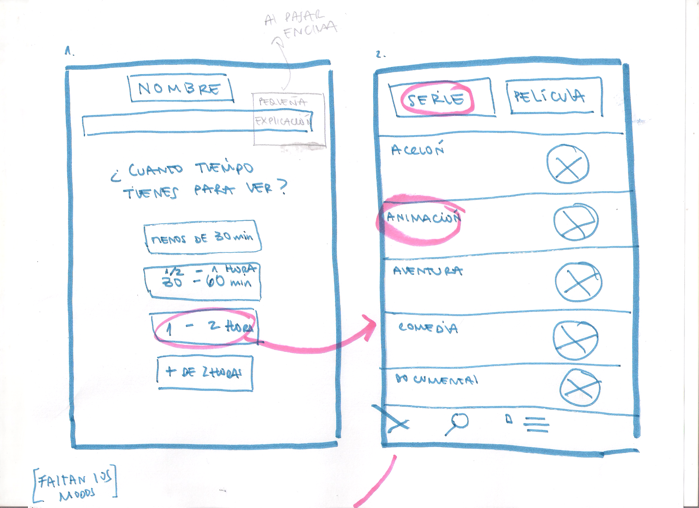

# Nombre que todavía no tiene

## **Descripción**
 es una aplicación...

## **Definición de usuario**
Se realizó una  [encuesta](https://docs.google.com/forms/d/1s_Q2comfimGzqFrxoVIecETbMywEb7x5iWU0fHTjIQw/edit#responses) para poder conocer más sobre las preferencias de los usuarios al momento de ver series y películas, mas del 70% ocupa netflix y ve entre 1 a 2 horas diarias,Chile ocupa el [quinto lugar](https://www.m360.cl/noticias/cultura-pop/actualidad/chile-es-el-quinto-pais-del-mundo-ve-mas-netflix/2017-12-11/153914.html) de personas que ven Netflix todos los días, la mayoría tiene entre 18 y 34 años,la mayoría trabaja y un 62% le gusta recibir recomendaciones de que ver.

## **Necesidad de usuario**
1. Recibir recomendaciones de series y películas que se acomoden al tiempo que disponga.
2. Poder filtrar según lo que quiera ver, series o películas.
3. Poder filtrar según el género que quiera ver.
4. Acceder a la información de forma rápida.

## **Historia de Usuario**
Para realizar el proyecto nos basamos en dos historias del usuario principales.

**1.**

como: usuario que ve series y películas.

quiero:que me recomiende p/s según mi tiempo
 disponible.

para: poder optimizar mi tiempo.

*criterios de aceptación*

dada: un rango de tiempos.
cuando:selecciones uno.
entonces:visualice las opciones de s/p para ver en ese tiempo.

**2.**

como: usuario que ve series y películas.

quiero:poder elegir ver series o películas.

para: recibir opciones más afines a lo que quiero.

*criterios de aceptación*

dada: las dos opciones.
cuando: seleccione una.
entonces: mostrará sólo de esa opción.

En la continuación del proyecto, se trabajaría con estas historias también, por el momento solo las enunciaremos.

**3.**

como: usuario que ve series y películas.

quiero:poder elegir el género.

para: recibir opciones más afines a lo que quiero.

*criterios de aceptación*

dada: las varias opciones.
cuando:selecciones una.
entonces:mostrará sólo s/p de esa opción.

**4.**

como: usuario que ve series y películas.

quiero:que me entreguen la información de forma rápida y minimalista.

para: optimizar mi tiempo.

*criterios de aceptación*

dada:
cuando:
entonces:

## **Definición de Terminado**

## **Ideación de Diseño**
Antes de comenzar, se analizaron páginas de referentes:

[Página 1](https://itunes.apple.com/cl/app/todomovies-4/id792499896?mt=8)se aprecia un orden claro de los género y de las opciones

[Página 2](https://play.google.com/store/apps/details?id=com.douglas.upflix&hl=es_419)

[Página 3](https://www.suggestmemovie.com/film/5508/The-Contender/) rescatamos la simpleza con que entrega la información, pero muy útil.

### ** Prototipo baja fidelidad**

### ** Prototipo alta fidelidad**
[Primer prototipo figma](https://www.figma.com/file/SZIt3atj8QRzB6MqwrGvxdZ8/hackathon-2.0.?node-id=0%3A1) 

### ** Test de usabilidad**
Se realizaron dos prototipos con pequeñas diferencias de fujo para testear, se les mostró ambos a 8 usuarios, de los cuáles 7 prefirieron la segunda opción se les hizo más fácil y entendible.

De acuerdo a ciertas observaciones como:
 * *más claros los rangos de tiempo*
 * *el botón "otra" les incomodó en el lugar que esta*
 * *la segunda pantalla, pensaron que le faltaba algo porque estaba muy vacía*
 se realizaron algunos cambios y se obtuvo el p [prototipo final.](https://www.figma.com/proto/ImgJy2vp33vNZOREzk93obgZ/prototipo-final?node-id=1%3A2&scaling=scale-down)

